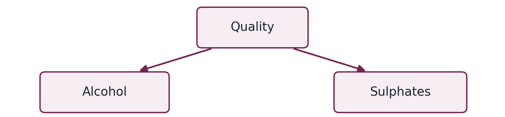
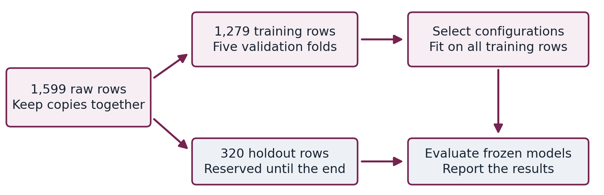

# Learning Wine Quality Prediction with Bayesian Networks

A beginner guide to the Python project and interactive explorer

This project asks whether laboratory measurements of a red wine can help predict its sensory quality score. It also asks a more useful question than simply naming a score: how should our uncertainty change when we know some measurements and leave others unknown?

We rebuilt an earlier university project written in R using Python. The rebuild keeps the research question, corrects problems in the evaluation, compares the network with simpler models, and makes the predictions explorable in a browser. The aim is a project whose reasoning you can explain and whose results someone else can reproduce.

You need no background in probability or Bayesian networks to use this guide. Start with the counting examples, then follow the actual experiment. By the end, you should be able to explain what the model learns, read its probability bars, describe a fair test, and discuss the project's limitations without relying on technical vocabulary.

**The main result.** The selected Bayesian network correctly predicts 181 of 320 held-out scores, or 56.6%. It is useful for learning about uncertain predictions, but it misses all held-out wines with scores 3, 4, and 8. Logistic regression wins the project's model-selection criterion. These findings are part of the project, including the disappointing ones.

### How to read the guide

- Chapters 1 to 5 explain the data, probability, Bayes' rule, graphs, and probability tables.
- Chapters 6 to 9 follow the experiment and explain why each method was used.
- Chapters 10 to 12 teach the results through the actual metrics and one real prediction.
- Chapters 13 and 14 connect the explanation to the dashboard and Python files.
- Chapters 15 to 17 cover limitations, a glossary, and further reading.

The examples marked **Teaching example** use invented numbers. Tables marked **Recorded experiment** come from the included Python results. This distinction matters: an easy example can teach a calculation without being evidence about wine.

Guide edition September 2026. Companion to Wine Quality Explorer. No model was retrained for this document.

## 1 Understand the prediction task and the data

Imagine receiving a wine's laboratory measurements before seeing its tasting score. The task is to use patterns in previously measured wines to estimate which score is plausible. A model is a mathematical rule learned from those examples. Learning that rule is called **training**; using it for another wine is **prediction**.

Each row in our data is one recorded wine sample. The eleven measurement columns are **features**, also called predictors or inputs. The quality column is the **target**, the outcome we want to predict. The model must not receive that wine's quality score as an input when it predicts it.

The source is the UCI Wine Quality dataset by Cortez and colleagues [1]. This project uses only its red-wine file: 1,599 rows from Portuguese red Vinho Verde wines. The underlying rating scale runs from 0 to 10, but this file contains only scores 3 through 8. Our model supports those six observed categories.

| Quality score | Number of rows | Meaning for learning |
| --- | ---: | --- |
| 3 | 10 | Very few examples |
| 4 | 53 | Few examples |
| 5 | 681 | Most common score |
| 6 | 638 | Almost as common as 5 |
| 7 | 199 | Less common |
| 8 | 18 | Very few examples |

**Recorded experiment.** Scores 5 and 6 make up 82.5% of the rows. This uneven distribution is called **class imbalance**. A model can look reasonably accurate by concentrating on these common scores while failing on the extremes.

The measurements cover acidity, sugar, chlorides, sulfur dioxide, density, pH, sulphates, and alcohol. A measurement describes a property of a wine; it does not automatically identify a controllable cause of quality. For example, pH describes acidity on its own scale. Sulphates and sulfur dioxide are different measurements and should not be treated as interchangeable.

Quality is a sensory assessment, not an objective statement about every person's preference. The file also lacks producer and batch identifiers that could help us test on genuinely separate sources. The study therefore evaluates prediction within this dataset, with limited evidence about other wine populations.

## 2 Learn probability by counting

**Probability** describes how much chance or uncertainty we assign to an event. An event is a statement that could be true, such as "this wine has quality 7 or 8." Probabilities range from 0 to 1. Multiplying by 100 expresses the same number as a percentage: 0.20 means 20%, or 20 out of 100.

**Teaching example.** Suppose a collection contains 100 wines, of which 20 have quality 7 or 8. We call those 20 "high quality" just for this example. If we choose a wine uniformly at random from this collection, the probability of high quality is 20 divided by 100, or 20%.

| In the teaching collection | High quality | Other quality | Total |
| --- | ---: | ---: | ---: |
| High alcohol | 12 | 18 | 30 |
| Other alcohol | 8 | 62 | 70 |
| Total | 20 | 80 | 100 |

Now someone tells us the chosen wine has high alcohol. We should look at the 30 wines in that row. Twelve have high quality, so the probability becomes 12 divided by 30, or 40%. This is a **conditional probability**: a probability calculated given some information. We write it as `P(high quality | high alcohol)`. The vertical line means "given."

The original 20% is a **marginal probability**: we do not specify alcohol. The probability of both high quality and high alcohol is 12 divided by 100, or 12%; that is a **joint probability**. Notice how the denominator changes with the question.

Knowing high alcohol changes the estimate from 20% to 40%. It still leaves 60% probability for other quality. Evidence can be informative without being decisive. Also, the collection shows an association; it does not show what would happen if someone changed the alcohol of an existing wine.

The real model returns a **probability distribution** over six scores. The scores are mutually exclusive: one recorded wine has one recorded score. Their probabilities must add to 100%, apart from display rounding. A 40% bar for score 6 means the model allocates 40% of its probability to that score; it does not mean the wine is "40% good."

**Check your understanding.** In the teaching collection, the probability of high alcohol given high quality is 12 out of 20, or 60%. It is different from the 40% probability of high quality given high alcohol. Reversing the question changes the group being counted.

## 3 Update a belief with Bayes rule

Bayes' rule lets us update a probability when new evidence arrives. It connects the two conditional questions from the previous chapter. You can understand it by counting the same wines from two directions.

**Teaching example.** Keep the collection of 100 wines. Before knowing alcohol, 20 of the 100 have high quality. Among those 20, 12 have high alcohol. Across the entire collection, 30 have high alcohol.

1. Start with the chance of high quality: 20%. This starting probability is the **prior** for the question.
2. Ask how often the evidence appears among high-quality wines: 12 out of 20, or 60%. This is the **likelihood** of the evidence given high quality.
3. Multiplying 20% by 60% gives 12%, the chance of both high quality and high alcohol.
4. Divide that 12% by the overall chance of high alcohol, 30%. The result is 40%, our updated probability of high quality given high alcohol.

The updated probability is called the **posterior**. Dividing by the probability of the evidence rescales the answer to the group we now know the wine belongs to. This rescaling is also called **normalization**.

You do not need to memorize the names first. The practical reasoning is: start with what is common, ask how compatible the new information is with each possibility, and recalculate their relative probabilities.

### What the word prior means in this project

The project uses "prior" in several related but different ways. A prior quality distribution describes the model's probabilities before measurements are supplied. The "original priors" model names refer to seven required graph arrows inherited from the R project. A parameter prior supplies small starting counts when estimating probability tables. These are three separate choices, not one interchangeable setting.

The explorer's starting distribution is learned from training data. It can therefore differ slightly from counting the full dataset. When you supply a measurement, the explorer calculates a conditional distribution using an already fitted model. It does not relearn the model from your slider movements.

**Check your understanding.** A posterior is not automatically more certain than a prior. New information can spread probability across alternatives when it conflicts with the patterns the model previously favored. "Updated" means it accounts for the evidence, not that it must have one very tall bar.

## 4 Read a Bayesian network

A **Bayesian network** combines a directed graph with probability tables. The graph describes which variables each local table depends on. The tables supply the numbers needed to calculate probabilities.

A **node** is one variable, such as alcohol or quality. An **arrow**, also called an edge or arc, connects a parent node to a child node. "Parent" means the arrow starts there; "child" means it ends there. These names describe the graph, not a biological relationship.

**Teaching graph.** In this small example, quality has no parents. Alcohol and sulphates each have quality as a parent. We would need one table for quality, one for alcohol given quality, and one for sulphates given quality. The real selected graph contains twelve nodes and twenty-eight arrows; this picture is only a three-node illustration.

A Bayesian network is a **directed acyclic graph**, abbreviated DAG. "Directed" means arrows have a direction. "Acyclic" means you cannot follow arrows forward and eventually return to your starting node. This restriction allows the joint probability to be assembled consistently from the local tables.

### Prediction can use evidence against an arrow

The graph above has an arrow from quality to alcohol, yet we can observe alcohol and ask about quality using Bayes' rule. The prediction target does not have to be the final node in a left-to-right diagram. In the actual selected network, quality is a parent of alcohol, sulphates, total sulfur dioxide, and volatile acidity. This does not prevent us from predicting quality from measurements.

An arrow learned from observational data is not proof of a physical cause. Different arrow directions can sometimes represent the same observational relationships. Saying "quality causes alcohol" simply because the fitted graph has that arrow would be unjustified.

The graph also expresses **conditional independence** assumptions. In the teaching graph, once quality is known, the model assumes alcohol and sulphates provide no additional information about each other. Without knowing quality, they can still be associated through that shared parent. This is why "no direct arrow" does not mean "independent." More complex graphs require checking all relevant paths, a topic called d-separation.

## 5 Understand probability tables and missing evidence

A graph without numbers cannot predict anything. Each node needs a **conditional probability table**, or CPT. For every combination of its parents' states, the table lists probabilities for the node's possible states. Each such row must sum to 100%.

**Teaching example.** Use the previous 100-wine collection and the arrow from quality to alcohol. To keep the calculation small, this example uses two states for each variable. The real network uses six quality states and three states per measurement.

| Quality state | Probability of high alcohol | Probability of other alcohol |
| --- | ---: | ---: |
| High quality | 60% | 40% |
| Other quality | 22.5% | 77.5% |

We obtained 22.5% by dividing the 18 high-alcohol wines of other quality by all 80 other-quality wines. To calculate the chance of high quality together with high alcohol, multiply the 20% probability of high quality by 60%. The result is 12%. For other quality together with high alcohol, multiply 80% by 22.5%, giving 18%.

When alcohol is known to be high, the two compatible possibilities have weights 12% and 18%. They add to 30%. Normalizing gives 12 out of 30, or 40%, for high quality and 18 out of 30, or 60%, for other quality. This is Bayes' rule implemented through a table.

### Unknown is different from medium

Suppose alcohol is unknown. We must consider both possible alcohol states. Adding their joint probabilities for high quality gives 12% plus 8%, returning the original 20%. Adding over possibilities for an unobserved variable is called **marginalization**.

The real explorer does the same kind of calculation with larger tables. An unchecked measurement is left unobserved and summed over. It is not set to zero, the median, or the "medium" category. Training still requires complete, valid measurements; support for partial evidence at prediction time is a separate capability.

The Python model uses exact inference through pyAgrum. The browser uses **variable elimination**, which multiplies smaller tables and sums out unknown variables in a careful order. These methods avoid explicitly listing every complete combination. "Exact" means they calculate the fitted model's probabilities without a sampling approximation. It does not mean the model perfectly describes real wines.

## 6 Follow the experiment in the right order

We want to estimate performance on wines the model has not learned from. This requires separating model development from the final evaluation. If information from the final evaluation affects learning, the reported performance can be misleading. This problem is called **data leakage**.

**Recorded experiment.** First, we load the raw measurements and group rows with identical values across all eleven features. There are 1,359 distinct measurement groups and 240 repeated rows. The repeats remain in the dataset, but a group is never split between learning and evaluation partitions. Grouping uses measurements, not quality labels.

We then reserve 320 rows as a final **holdout**, also called the test set. The remaining 1,279 rows are for model development. The split tries to preserve the proportions of quality classes while keeping groups together. This is called stratified group splitting. Exact class proportions are not always possible when groups must remain intact.

Within the 1,279 training rows, we use **five-fold cross-validation**. We divide those rows into five parts. Each time, four parts teach a fresh model and the fifth evaluates it. We rotate the evaluation part until every part has served once. These temporary evaluation parts are **validation** sets; they are separate from the final holdout.

Every fold learns its own preprocessing, network arrows, and probability tables from its four training parts. Logistic regression also learns its scaling there. Reusing boundaries or arrows learned from all rows would allow information to cross the intended boundary [2].

We compare seven prespecified model configurations using the average validation macro-F1 score, explained in Chapter 10. We select an overall model and a Bayesian network before examining their holdout results. We then fit each frozen configuration on all 1,279 training rows and evaluate it on the same 320 holdout rows.

The explorer keeps that training-only fitted network. It is not later refitted on all 1,599 rows. Seed 123 fixes the outer split; seed 124 fixes the inner folds. A seed makes randomized choices repeatable; it does not make one split universally representative.

## 7 Turn measurements into categories

The chosen Bayesian networks use discrete states. A discrete variable has a fixed list of categories. A continuous measurement, such as alcohol percentage, can take many numerical values. We convert each measurement to "low," "medium," or "high" so the network can use compact probability tables.

This conversion is called **discretization** or binning. We sort each feature's training values and find two boundaries: approximately one-third and two-thirds of the way through the distribution. These are quantiles. Tied values can prevent the resulting groups from containing exactly equal numbers of rows.

| Alcohol value in the recorded fitted model | Category |
| --- | --- |
| Below 9.7% alcohol by volume | Low |
| From 9.7% up to but below 10.8% | Medium |
| 10.8% and above | High |

**Recorded experiment.** A value exactly equal to a boundary enters the higher bin. Therefore 9.7% is medium and 10.8% is high. The selected model's volatile-acidity boundaries are 0.43 and 0.60 g/L; its sulphates boundaries are 0.58 and 0.68 g/L. These boundaries come from the 1,279 training rows. Validation models learn different boundaries from their own training parts.

### Why use bins and what do they cost

Three states keep the tables smaller, make the model easy to inspect, and let the browser apply exactly the same categories as Python. The price is lost detail. Alcohol values of 9.8% and 10.7% both become medium. If all other evidence stays the same, moving between those values cannot change this model's prediction.

A prediction may jump when a slider crosses a boundary. That jump comes from categorization; it is not evidence that wine quality changes abruptly at that chemical value. "High" means high relative to this training distribution, not a universal quality or safety threshold.

The R version used Hartemink discretization, which aims to retain pairwise information between variables while reducing categories. This rebuild uses simpler marginal quantiles, calculated for each feature separately. They are different methods, so the Python results are not an exact numerical replication of the R experiment [3].

The continuous-input baseline models help test whether the network's simplification costs predictive performance. There is no need to assume that a more understandable representation will always be more accurate.

## 8 Learn the arrows and then their probabilities

Training a Bayesian network has two main tasks. **Structure learning** chooses the arrows. **Parameter learning** estimates the numbers in the probability tables for that chosen graph. A graph can be sensible-looking and still have poorly estimated probabilities; both tasks need evaluation.

The Python implementation uses pyAgrum's greedy hill-climbing search [4]. It considers local changes, such as adding, removing, or reversing an arrow, while preserving a valid acyclic graph and the stated constraints. It takes an improving change and repeats until no allowed local improvement is found. "Greedy" means choosing the best available next step; it does not guarantee finding the best possible graph among all graphs.

### Balance fit against complexity

A larger graph can fit detailed patterns in training data, including accidental ones. Fitting accidental details is **overfitting**: a model performs well on its examples but less well on new cases. We score candidate graphs using the Akaike information criterion (AIC) or Bayesian information criterion (BIC). Both balance fit with a penalty for the number of free parameters, the numerical values the model must estimate.

For datasets of this size, BIC generally imposes a stronger complexity penalty per parameter than AIC. Neither criterion is a percentage of correctly predicted quality scores. They assess a model of the joint data; target-specific validation still determines which configuration we select. Software may express these scores with different signs or scales, so the learner's documented convention matters.

Each network has at most three parents per node. With three-state parents, each additional parent triples the number of parent combinations in its child's table. Limiting parents controls table size, computation, and the risk of estimating probabilities from tiny groups.

We compare AIC and BIC both with and without seven required arrows inherited from the R project. Those arrows are assumptions to test. The selected AIC network has no forced arrows. This does not establish that expert knowledge is useless; it describes these particular assumptions in this experiment.

### Avoid certainty from small counts

After selecting a graph, we estimate its tables with BDeu smoothing and equivalent sample size 5. Smoothing adds small prior counts so an unobserved combination does not automatically receive probability zero. The prior mass is distributed over configurations; it is not five extra wines in every table cell. This helps numerical behavior but cannot replace real examples of rare quality scores.

BDeu is used here for parameter estimation after AIC or BIC graph learning. It is not the graph-selection score used in the four network candidates.

## 9 Compare the network with simpler alternatives

A model's score is difficult to judge without a comparison. We therefore evaluate three **baselines** alongside four Bayesian network configurations. A baseline answers what performance we can obtain with a simpler or different approach under the same evaluation rules.

| Candidate | What it learns or predicts | Reason to include it |
| --- | --- | --- |
| Majority baseline | Always predicts the most common training score; returns training class frequencies as probabilities | Checks whether using measurements adds value |
| Logistic regression | Combines numerical measurements into a probability for each of the six classes | Gives a standard, relatively simple continuous-input comparison |
| Random forest | Combines predictions from 300 decision trees | Tests a flexible method that can learn nonlinear relationships |
| Four Bayesian networks | AIC or BIC, each with or without the seven required arrows | Tests the network choices inherited from the study |

Despite its name, the logistic regression used here is a classification method: it predicts categories. "Multinomial" means it handles more than two categories. Each feature is standardized using its training mean and spread so that measurements in different units are on comparable scales. This scaling is learned inside each validation fold.

A decision tree repeatedly splits data with questions about measurements. A random forest combines many trees trained with randomness in their examples and feature choices, reducing reliance on one tree. Our forest has 300 trees and requires at least two training observations in a leaf, the terminal group used for a prediction.

Both of these alternatives receive the original continuous measurements. Their comparison with discretized networks measures the usefulness of complete approaches; it does not isolate the effect of the graph algorithm alone. To isolate that effect, we would need an additional carefully designed experiment with shared preprocessing.

All seven configurations use the same outer holdout and inner folds. Their settings are fixed in advance. We select by mean validation macro-F1, rather than searching for whichever model happens to have the highest final test accuracy.

The dashboard centers a Bayesian network because exploring conditional probabilities is the project's research topic. It also reports the overall selected model. Keeping a stronger alternative visible makes the portfolio's conclusion more credible: the network's educational and inference capabilities are valuable even when it does not win the prediction comparison.

## 10 Read the metrics without being misled

A **metric** is a numerical way to evaluate a model. Different metrics answer different questions. Here a predicted score means the score with the largest model probability. The expected score displayed in the explorer is a separate weighted average.

**Accuracy** is the fraction of exact matches. If 60 out of 100 predicted scores match the recorded scores, accuracy is 60%. It treats a mistake by one point the same as a mistake by four points. It can hide poor results on rare classes.

**Recall for a class** asks how many actual members of that class we find. **Precision for a class** asks how many predictions of that class are correct. For the selected network's real score-7 results, 16 of 40 actual score-7 wines are identified: recall is 40%. It predicts score 7 for 29 wines, of which 16 are correct: precision is 55.2%.

**F1** combines precision and recall. To calculate it, multiply precision by recall, double the result, and divide by their sum. Using the unrounded score-7 fractions gives F1 of about 0.464. **Macro-F1** averages the six class F1 scores equally. Each rare class counts as much as a common class. Scores range from 0 to 1, with 1 best. Macro-F1 is not an accuracy percentage. Undefined class scores are set to zero in this experiment.

| Other output | How to read it |
| --- | --- |
| Mean absolute error | Average number of score points missed; lower is better |
| Within one point | Fraction of predictions no more than one score point away |
| Macro recall | Average recall across the six classes, giving them equal weight |
| Log loss | Penalizes low probability assigned to the true score, especially confident mistakes; lower is better |
| Quadratic weighted kappa | Measures agreement relative to a chance baseline and penalizes larger score gaps more heavily |

A **confusion matrix** counts actual scores down the rows and predicted scores across the columns. Its diagonal contains correct predictions. Off-diagonal cells show which mistakes occur. Always check its orientation before reading it.

A **calibration plot** groups predictions by their largest probability and compares that confidence with actual accuracy. For example, predictions around 70% confidence should be right roughly 70% of the time if well calibrated. Our plot checks confidence in the top class, not every possible aspect of probability calibration. Groups with few wines give noisy estimates.

## 11 Interpret the recorded results

**Recorded experiment.** The table shows average training-validation macro-F1 and performance on the frozen 320-row holdout. Values are rounded for reading; the full values are saved in `dist/results.json`.

| Model | Validation macro F1 | Holdout accuracy | Holdout macro F1 |
| --- | ---: | ---: | ---: |
| Majority baseline | 0.100 | 42.5% | 0.099 |
| Logistic regression | 0.289 | 60.0% | 0.397 |
| Random forest | 0.281 | 62.8% | 0.308 |
| BN with BIC | 0.256 | 54.1% | 0.244 |
| BN with AIC | 0.267 | 56.6% | 0.277 |
| BN with BIC and original priors | 0.264 | 54.1% | 0.265 |
| BN with AIC and original priors | 0.256 | 57.5% | 0.278 |

Logistic regression wins the prespecified validation criterion overall. AIC without forced arrows wins among the networks. The forest's higher holdout accuracy does not change those selections: it is a different metric on data reserved for evaluation. Choosing a new winner after seeing this table would change the experiment's decision rule.

The selected network makes 181 exact matches out of 320. Its mean absolute score error is 0.484 points, and 95.3% of predictions are within one point. That last figure sounds strong partly because most scores are near the middle of the scale. It cannot replace class-specific results.

The selected network identifies none of the actual score-3, score-4, or score-8 wines in the holdout. Those classes contain only 2, 11, and 4 holdout observations respectively. It identifies 87 of 136 score-5 wines, 78 of 127 score-6 wines, and 16 of 40 score-7 wines. Rare-class performance remains a central weakness.

### How uncertain is the accuracy estimate

We resample the holdout measurement groups with replacement 500 times and recalculate accuracy. "With replacement" means a sampled group can appear more than once. The middle 95% of these bootstrap scores runs from approximately 49.6% to 62.7% for the selected network.

This interval reflects holdout sampling variation conditional on this trained model and split. It does not include every uncertainty from retraining, model selection, or a different wine population. It is also not the arrow-stability bootstrap described in Chapter 13: no arrows are relearned in this calculation. The small validation gaps between models do not establish a universal ranking.

## 12 Trace one real prediction from evidence to result

Use the held-out sample whose actual quality is 3, source row index 459. Its alcohol is 9.0%, sulphates 0.57 g/L, and volatile acidity 0.58 g/L. The fitted boundaries map those measurements to low alcohol, low sulphates, and medium volatile acidity. The quality label is shown only for comparison; it is not supplied to inference.

| Quality score | No measurements | Alcohol alone | All eleven measurements |
| --- | ---: | ---: | ---: |
| 3 | 0.69% | 0.45% | 0.13% |
| 4 | 3.34% | 3.54% | 24.29% |
| 5 | 42.51% | 67.20% | 63.63% |
| 6 | 39.86% | 27.60% | 11.81% |
| 7 | 12.45% | 1.14% | 0.13% |
| 8 | 1.16% | 0.07% | Less than 0.01% |

**Recorded experiment.** These are saved Python reference-query probabilities, rounded here. Columns may not sum to exactly 100% after rounding. "No measurements" uses the fitted network's marginal quality distribution; it is not the raw full-dataset histogram.

Knowing alcohol alone raises the probability of score 5 from about 42.5% to 67.2%. Adding all measurements lowers it to 63.6% and gives score 4 more probability. Evidence does not have to keep pushing the answer in one direction.

With all measurements, the most likely score is 5. The true score is 3, so the model makes a two-point error and assigns very little probability to the truth. This is a useful example precisely because it fails. It demonstrates why a tall probability bar is not a guarantee and why rare-class evaluation matters.

The **expected score** multiplies each possible score by its probability and adds the products. For this full-evidence prediction it is about 4.88. The most likely score remains 5. An expected score can lie between categories; the model has not created a new recorded quality label of 4.88.

The displayed probability of "7 or 8" adds the two mutually exclusive class probabilities. Here it is about 0.135%. This is a descriptive summary of the fitted distribution, not a tested rule for deciding which wines to buy.

Trace the code in this order: the input dictionary contains measurements; `QuantileBins.evidence` assigns their categories; `WineBN.query` conditions the network on those categories; the returned six probabilities are summarized for display. Clearing an input removes that evidence rather than setting a replacement value.

## 13 Learn by using the dashboard

Open the hosted Wine Quality Explorer or run the included local server described in Chapter 14. The interface uses probability tables already learned by Python. You can study the outputs without installing the training libraries.

### Start with the probability bars

1. Open **Predict a wine** and select **Clear all**. Read the probabilities before any measurement is known. Notice that several scores remain plausible.
2. Include alcohol alone. Move it within one displayed category, then across a category boundary. The probabilities should stay fixed within a bin and may change at a boundary.
3. Include sulphates and volatile acidity. Ask which scores gained probability and which lost it. Do not assume that adding evidence must make the tallest bar taller.
4. Uncheck a measurement. You are now asking the model to average over that unknown quantity, not asking about a wine with zero of it.
5. Choose the held-out quality-3 sample used in Chapter 12. The picker supplies all eleven measurements. Compare the actual score with the most likely and expected scores.

The darker probability bars represent your supplied evidence. The muted bars show the distribution without measurements. Their comparison answers how the fitted model's beliefs changed for this query.

### Inspect the evaluation and graph

In **Compare models**, switch between training cross-validation and the final holdout. Identify which numbers were used to choose the models. Inspect the chosen network's confusion matrix and explain why its overall accuracy does not describe its ability to find score-8 wines.

In **Explore the network**, select quality and read its parents and children. The arrows show the fitted dependency structure. Selecting a node is an explanation tool; it does not alter the model. Use Chapter 4 to explain how measurements can inform quality even when arrows point outward from quality.

The arrows are also drawn by stability. The selected recipe was relearned on 1,000 resamples of the training wines, drawing measurement groups with replacement. Hover over an arrow to read how often it appeared in those graphs and how often it pointed the drawn way. Solid arrows appeared in at least 85% of the resamples, the threshold the original R project used to keep an arrow; dotted arrows appeared in fewer than half. This is a diagnostic of the frozen model. It changes no prediction, and it cannot make an arrow causal.

In **Data and methodology**, compare the class counts and read the experiment sequence. Use this view when explaining the project to someone else: start with the question and the split before discussing the graph's appearance.

### Practice and check your explanation

**Exercise.** Why can 9.8% and 10.7% alcohol give the same prediction when other inputs are unchanged? **Answer.** Both are medium in the selected model. Binning has discarded the difference.

**Exercise.** Does moving an alcohol slider show the effect of physically adding alcohol? **Answer.** It changes the information conditioned on by an observational model. It does not simulate a validated chemical intervention.

**Exercise.** In **Explore the network**, select quality. Which of its arrows is least stable, and what does a direction share near 50% mean? **Answer.** The arrow to total sulfur dioxide appears in the fewest resamples. A share near 50% means the resamples learned each direction about equally often: the data support a dependency between the two variables but do not determine which way the arrow points.

## 14 Connect the learning steps to the Python files

The project separates training from exploration. This makes the delivered results quick to open and lets a reviewer inspect how they were produced. The source files use a few libraries with distinct jobs: pandas for data tables, NumPy for numerical arrays, scikit-learn for evaluation and baseline models, and pyAgrum for Bayesian networks.

| File or object | Its role in the learning process |
| --- | --- |
| `data/winequality-red.csv` | Original observations and target scores |
| `QuantileBins` in `src/wine_quality/model.py` | Learns training boundaries and applies them to measurements |
| `WineBN` in the same file | Learns the graph and tables, then answers probability queries |
| `train.py` | Creates the grouped splits, compares models, selects them, and exports results |
| `bootstrap_structure.py` | Relearns the selected recipe on resamples and records each arrow's stability |
| `dist/results.json` | Records scores, row indices, cut points, graph, tables, and software versions |
| `data/holdout-predictions.csv` | Lets you inspect each held-out prediction and its probabilities |
| `dist/inference.mjs` and `dist/app.mjs` | Calculate browser probabilities and update the interface |
| `tests/` | Checks evaluation boundaries and consistency of the implementation |

To explore the existing results, extract the project ZIP and open a terminal in its folder. Run `python serve.py`, then open `http://localhost:8000`. Keep that terminal open while using the app. Stop the server with Ctrl+C. On systems where Python is named `python3`, use that command instead.

To retrain, use the environment-creation and installation commands in `README.md`, then run `python train.py` followed by `python bootstrap_structure.py` for the arrow stability shown in the network view. A virtual environment is a separate set of Python packages for this project. `requirements.txt` pins the direct modelling libraries. The saved run used Python 3.12.14, pandas 2.2.3, NumPy 2.3.5, scikit-learn 1.8.0, and pyAgrum 3.1.1; these are recorded versions, not a claim that each is the latest release.

The training script overwrites the result exports with its new run. Preserve the current results before experimenting if you want to compare versions. A recorded data checksum helps detect whether the source CSV changed.

Six Python tests passed for split integrity, train-only preprocessing, valid probabilities, saved-model consistency, and selection. Browser inference matched Python on 41 saved queries, including partial evidence and bin boundaries. These checks support implementation consistency. They do not prove predictive validity for other wines. Full browser interaction testing was not performed in the original delivery.

## 15 Explain the improvements and the remaining limits

The earlier R project had a worthwhile research question and explored network learning, prior arrows, and uncertain predictions. The language was not the central problem. The strongest improvements concern how the evidence is evaluated and explained.

The original script discretized the whole dataset and initially learned graphs before splitting training and test rows. Learning those relationships involved future test labels. Fitting probability tables on training rows afterward could not remove that information from the chosen graph. The rebuild splits first and relearns every data-dependent step inside validation.

The original AIC prediction block also used the BIC fitted object. That copy-and-paste error means an AIC label did not guarantee an AIC result. A shared evaluation loop now ties each result to its named model configuration. The detailed R audit is retained in `docs/LEARNING_GUIDE.md`.

Other changes are deliberate methodological choices. Quantile bins replace Hartemink; pyAgrum hill climbing replaces the original comparison of Grow-Shrink, hill climbing, and MMHC; exact inference uses all supplied evidence. The original graph bootstrap is reproduced only as the arrow-stability diagnostic in Chapter 13; no averaged network is used for prediction. The holdout-accuracy bootstrap serves a different purpose. New scores therefore should not be advertised as a like-for-like performance improvement over the R numbers.

### What remains unresolved

Three bins discard numerical information, and the model treats quality classes as nominal during fitting. **Nominal** means it fits six categories without explicitly using their order; although we report score-distance metrics, this does not turn the model into an ordinal one. **Ordinal modelling** would use the fact that 7 is closer to 6 than to 3 during learning.

Rare extreme scores have too few examples for dependable evaluation. Duplicate grouping reduces one source of leakage but cannot replace unavailable producer or batch grouping. A single dataset and holdout cannot establish performance on another region, white wines, or future production. The learned arrows also do not establish causation.

### Sensible next experiments

Choose one question at a time: does an ordinal model improve score-distance errors; does a faithful Hartemink rebuild change the result; or does keeping only the arrows that proved stable under resampling (Chapter 13) change the predictions? Write the comparison and success metric before running it. Once repeated improvements use this holdout as feedback, it becomes development data; use new independent data or an appropriate nested evaluation for a fresh final estimate.

A credible portfolio can present the original project, explain the audit, document the rebuild, and discuss the evidence honestly. The most useful interview skill is being able to justify a decision and recognize where its conclusion stops.

## 16 Keep a glossary beside the code

| Term | Plain meaning in this project |
| --- | --- |
| Feature | A measured input, such as alcohol |
| Target or class | The quality score to predict, or one of its six categories |
| Training | Learning rules, boundaries, arrows, or table values from examples |
| Evidence | Measurements supplied for a particular prediction |
| Probability distribution | Probabilities over all possible scores, summing to one |
| Conditional probability | Probability after specifying some information |
| Prior and posterior | Probability before and after the evidence for a question |
| Likelihood | How compatible observed evidence is with a proposed possibility |
| Node and arc | A variable and a directed connection in the graph |
| Parent and child | The start and end of an arrow |
| DAG | Directed graph with no directed cycle |
| CPT | Table of probabilities for a node given its parent states |
| Inference | Calculating a probability from the fitted model |
| Marginalization | Adding over the possibilities for something unknown |
| Discretization | Turning numerical values into categories |
| Cross validation | Rotating separate learning and evaluation parts within development data |
| Holdout | Rows reserved for final evaluation |
| Leakage | Evaluation information entering model development |
| Overfitting | Learning accidental training patterns that do not generalize |
| Baseline | A reference method used to judge whether added complexity helps |
| Calibration | Agreement between stated probability and observed frequency |
| Bootstrap | Resampling observed units with replacement to study variation |

**Three distinctions to remember.** Training changes the model; inference asks a question of it. A prediction estimates an outcome; a causal claim describes the result of intervening. A passing software test checks specified behavior; a fair statistical evaluation estimates performance under stated sampling conditions.

## 17 Find the evidence and read further

The numerical source for this guide is the recorded Python experiment in `dist/results.json`. You can inspect row-level outputs in `data/holdout-predictions.csv` and the fitted network in `data/selected-network.bif`. The BIF file is a standard text representation of a Bayesian network; it preserves variables, graph structure, and probability tables for other compatible tools.

The explanatory examples with 100 wines are invented for teaching. The six-class result table and source-row-459 example are actual project outputs. The guide's figures show a teaching graph and the experiment's sequence, not a causal model of wine production.

### Primary references

1. Cortez, Cerdeira, Almeida, Matos, and Reis. **Wine Quality dataset**, UCI Machine Learning Repository, 2009. DOI 10.24432/C56S3T. Dataset context, variables, attribution, and CC BY 4.0 license. [UCI Wine Quality](https://archive.ics.uci.edu/dataset/186/wine+quality).
2. Scikit-learn documentation. **Common pitfalls and recommended practices**, especially data leakage and consistent preprocessing. Read this after Chapter 6. [Avoiding data leakage](https://scikit-learn.org/stable/common_pitfalls.html#data-leakage).
3. bnlearn documentation. **Preprocessing and discretization**. Describes the Hartemink method used by the R project. [bnlearn preprocessing](https://www.bnlearn.com/documentation/man/preprocessing.html).
4. pyAgrum documentation. **Learning Bayesian networks**. API reference for the graph learning and parameter estimation used in Python. Read after Chapters 5 and 8. [pyAgrum learning](https://pyagrum.readthedocs.io/en/latest/BNLearning.html).
5. bnlearn documentation. **Cross-validation** and **prediction**. Useful when comparing the original R calls with the rebuild's evaluation and inference. [bnlearn cross-validation](https://www.bnlearn.com/documentation/man/bn.cv.html) and [bnlearn prediction](https://www.bnlearn.com/documentation/man/predict.and.impute.html).

### A short way to explain the project aloud

"I studied whether laboratory measurements can predict red-wine quality, while showing uncertainty over possible scores. I rebuilt my R study in Python and corrected leakage by learning all preprocessing and model structure within training data. I compared Bayesian networks with simple baselines, selected models through validation, and evaluated the frozen choices on grouped held-out data. The network supports interactive queries with missing measurements, but simpler models performed better on the chosen predictive criterion and rare quality scores remain difficult."

Use that explanation only once you can connect each sentence to the code or results. To prepare, explain the 100-wine example without formulas, trace the split before any fitting, and walk someone through the failed prediction in Chapter 12. Those three activities reveal whether you understand the probability, evaluation, and limitations behind the interface.
